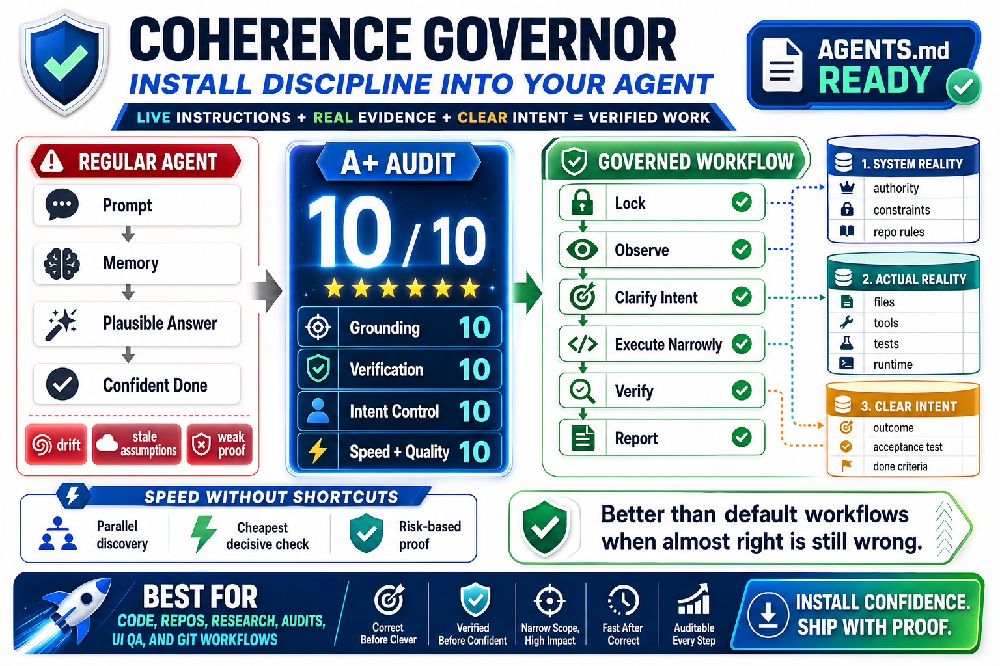

# Agents

Reusable agent operating contracts live here. Each agent sits in its own folder with an `AGENTS.md`, matching the skill layout used under `skills/`.

## Agent Catalog

### Coherence Governor

Path: `agents/coherence-governor/AGENTS.md`

Coherence Governor is a high-control execution contract for agents that need to stay grounded under pressure. It turns a regular agent workflow into a coherence-first loop: lock the active instructions, inspect real evidence, clarify intent, execute narrowly, verify the result, and report only what is true.



Use Coherence Governor when you want an agent to:

- Follow the live instruction stack without drifting into preference.
- Inspect files, tools, docs, runtime output, and git state before making claims.
- Turn messy requests into concrete acceptance tests.
- Keep changes narrow, verified, and auditable.
- Move fast by parallelizing independent discovery and escalating verification only when risk requires it.

It is designed for coding, repo work, audits, research, UI QA, documentation, and git operations where a confident-but-unverified answer is not good enough.

Add new agents below this section using the same pattern: title, path, short explanation, optional image, and practical use cases.

## Layout

```text
agents/
`-- coherence-governor/
    `-- AGENTS.md
```

Use `agents/[agent-name]/AGENTS.md` for new agents.
